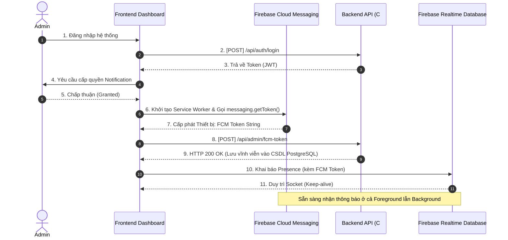

# TÀI LIỆU ĐẶC TẢ TÍCH HỢP HỆ THỐNG
**Phân hệ:** Quản trị viên (Admin Dashboard)  
**Chủ đề:** Tích hợp Push Notification (FCM) & Trạng thái Trực tuyến (Presence)  
**Mức độ bảo mật:** Nội bộ Dự án  

---

## 1. TỔNG QUAN QUY TRÌNH (OVERVIEW)

Tài liệu này đặc tả quy trình tích hợp phía Front-end nhằm đảm bảo quản trị viên hệ thống có thể nhận thông báo (Push Notification) theo thời gian thực (Real-time). Quy trình này bắt đầu từ chu trình Xác thực hệ thống (Authentication), trải qua bước Cấp phép Trình duyệt (Browser Permision), Lưu trữ Mã định danh (FCM Token Persistence) và kết thúc ở cơ chế Lắng nghe Thông điệp (Message Handling).

Sự kết hợp giữa **RESTful API** (phục vụ lưu trữ gốc) và **Firebase SDK** (phục vụ TCP socket và cơ chế Push của hệ điều hành OS) tạo nên một luồng vận hành khép kín và có độ trễ cực thấp.

---

## 2. KỊCH BẢN KÍCH HOẠT PUSH NOTIFICATION (BUSINESS LOGIC & TESTING)

Để Frontend Team nắm rõ **TẠI SAO** và **KHI NÀO** thì tiếng chuông (Pop-up Push Notification) mới nhảy lên, dưới đây là luồng Business Logic mà Backend xử lý. FE dựa vào kịch bản này để giả lập (Test) độ trơn tru của Push FCM.

🔔 **Push Notification CHỈ bắn ra nếu Hội đủ các điều kiện sau đây ráp lại:**
1. Khách truy cập vào nhánh API `POST /api/v1/chat/message`.
2. Trợ lý AI (Gemini) cố gắng phân tích và trả lời câu hỏi. Tuy nhiên, nếu câu hỏi nằm ngoài vùng dữ liệu (Out of Scope), câu hỏi mang tính mua hàng/khuyến mãi, cấu trúc ngầm của AI sẽ báo cờ chuyển hướng (Fallback Route) sang **Phục vụ bởi Người Thật (Human Routing)**. (Đôi khi là User ấn nút Gọi Admin thẳng bằng API `/api/v1/chat/request-human`).
3. Backend lục tìm danh sách Admin rảnh rỗi trên Firebase Realtime Database. Cục diện Backend nhận ra **TOÀN BỘ ADMIN ĐỀU ĐANG OFFLINE** (Chưa ai mở Dashboard / Hoặc tắt Wifi / Không có ai gắn biến `online: true`).
4. Tại chính xác Mili-giây này, Backend thu thập toàn bộ Chuỗi `FCM_Token` trong PostgreSQL của mọi Admin đã cấp hổi xưa và thực thi lệnh Firebase Multicast. **Push Notification dội thẳng vào máy Admin ngay lập tức.**

> [!TIP]
> **Cách thức FE giả lập để Test báo Push như sau:**
> 1. Dashboard Admin Đăng nhập và Bấm Xin quyền FCM Token. Đóng cửa sổ trang Dashboard đi (để ngắt kết nối SDK làm Realtime Đổi thành Offline).
> 2. Mở Postman gửi tin nhắn cực khó và nhạy cảm mua bán vào `/api/v1/chat/message`. Hoặc gọi `/api/v1/chat/request-human`.
> 3. Để im màn hình, lúc này Popup thông báo góc bên phải màn hình PC của Admin sẽ văng lên.

---

## 3. SƠ ĐỒ TUẦN TỰ (SEQUENCE DIAGRAM)



---

## 4. CHI TIẾT CÁC GIAI ĐOẠN TÍCH HỢP CODE

### GIAI ĐOẠN 1: Xác thực Hệ thống (Authentication)
Frontend cần được cấp phép truy cập tài nguyên trước khi khởi tạo luồng Token.

**Endpoint:** `POST /api/auth/login`
**Payload chuẩn:**
```json
{
  "email": "user@domain.com",
  "password": "Mật khẩu mã hóa"
}
```
**Hành động FE:** 
* Lưu trữ `accessToken` vào HTTP-Only Cookies hoặc `localStorage`. 
* Sử dụng JWT này để phân quyền cho mọi Endpoint API kế tiếp.

### GIAI ĐOẠN 2: Sinh Mã Định Danh Thiết Bị (FCM Token Generation)
Đây là thời điểm Frontend thao tác hoàn toàn với kiến trúc nội bộ của Browser và Client SDK của Google. Không có sự tham gia của Backend.

**Yêu cầu môi trường:** 
* Giao thức SSL/TLS (HTTPS).
* Website phải trỏ tới file Service Worker ở thư mục gốc: `/firebase-messaging-sw.js`.

**Hành động FE:**
1. Khởi chạy `Notification.requestPermission()`. Ngưng tiến trình nếu User từ chối (`denied`).
2. Tích hợp Web Push Certificate (VAPID Key).

```javascript
// Import Firebase v9/v10
import { initializeApp } from "firebase/app";
import { getMessaging, getToken } from "firebase/messaging";

const app = initializeApp(firebaseConfig);
const messaging = getMessaging(app);

// Đăng ký Background Service Worker
const swRegistration = await navigator.serviceWorker.register('/firebase-messaging-sw.js');
await navigator.serviceWorker.ready;

// Yêu cầu Firebase cấp quyền định danh cho tab này
const currentFcmToken = await getToken(messaging, {
    vapidKey: "<VAPID_KEY_CẤP_TỪ_FIREBASE_CONSOLE>",
    serviceWorkerRegistration: swRegistration
});

// Lưu trữ currentFcmToken vào Redux/Vuex Store.
```

### GIAI ĐOẠN 3: Lưu trữ & Định tuyến FCM Token
Backend cần biết được FCM Token của Admin để thực thi hành động đẩy tin nhắn (Push) khi Admin vô tình đóng trình duyệt hoàn toàn (như được đề cập ở Chương 2). 

**Endpoint lưu trữ:** `POST /api/admin/fcm-token`
* **Headers:** `Authorization: Bearer <JWT_TỪ_BƯỚC_1>`
* **Content-Type:** `application/json`

**Cấu trúc Payload:**
```json
{
  "token": "chuoi-fcm-token-duoc-cap-o-giai-doan-2"
}
```
*Ghi chú:* Backend sẽ tự động cập nhật trường `fcm_token` vào bảng `Users` trên PostgreSQL. 

### GIAI ĐOẠN 4: Khai Báo Trạng Thái Trực Tuyến (Online Presence Strategy)
Hệ thống Load-Balancing nội bộ của Backend yêu cầu Frontend phải tự động báo "Có mặt" hoặc "Rời mạng" thông qua hạ tầng Firebase Realtime Database. Endpoint này không truyền thông qua HTTP mà thông qua Persistent Socket.

**Hành động FE:**
Viết Logic kích hoạt Listeners sau khi Đăng nhập thành công và có FCM Token:

```javascript
import { getDatabase, ref, onValue, onDisconnect, set, serverTimestamp } from "firebase/database";

const db = getDatabase(app);
const adminPresenceRef = ref(db, `presence/admins/<ADMIN_ID>`);
const connectedNetworkRef = ref(db, ".info/connected"); // Built-in route Firebase

// Lắng nghe tính trạng mạng của Network Adapter
onValue(connectedNetworkRef, (snapshot) => {
  if (snapshot.val() === true) {    
    // 4.1 Xây dựng "Di chúc" (OnDisconnect Trigger).
    // Nếu mạng đột ngột cúp hoặc Tab End Process, Firebase Server TỰ ĐỘNG dội khối lệnh này xóa ngõ hiển thị.
    onDisconnect(adminPresenceRef).set({
      online: false,
      lastSeen: serverTimestamp(),
      fcmToken: currentFcmToken // Kèm token để phòng trường hợp BE tra soát Offline
    }).then(() => {
      // 4.2 Thiết lập giá trị Realtime Mặc định. Mọi Request Routing sẽ đổ về Admin này.
      set(adminPresenceRef, {
        online: true,
        displayName: "<TÊN_HIỂN_THỊ>",
        fcmToken: currentFcmToken
      });
    });
  }
});
```

### GIAI ĐOẠN 5: Xử lý Tín Hiệu Push Notification Cục Bộ
Lúc Backend rà soát Firebase thấy toàn bộ `online: false` do Front-end đã disconnect. Backend gửi FCM tới hệ điều hành.

#### Hướng 5.1: Xử lý Background (Tab Đã Đóng / Máy Khóa Màn Hình)
Tin nhắn Push sẽ bật lên trên Context Native của Window/MacOS. Xử lý logic Click Notification được viết riêng tại File: `firebase-messaging-sw.js`.

```javascript
self.addEventListener('notificationclick', (event) => {
    // Đóng Popup
    event.notification.close();
    
    // Đọc URL từ Data Meta do Backend đẩy lên qua Firebase
    // BE cung cấp đường dẫn `/admin/messages`
    const targetUrl = event.notification.data?.url || '/admin/messages';
    
    // API Native mở Window ngầm (Background Fetch Window)
    event.waitUntil(clients.openWindow(targetUrl));
});
```

---

*Kết thúc tài liệu. Báo cáo kiến trúc được đối chiếu theo phiên bản v1 API.*
